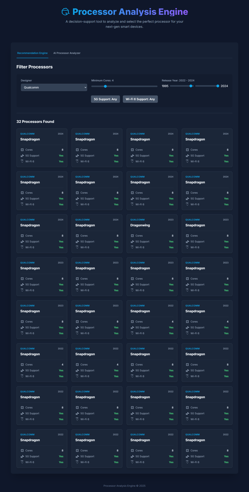

# Processor Analysis Engine - React Frontend

[![React][React-shield]][React-url]
[![TypeScript][TypeScript-shield]][TypeScript-url]
[![Vite][Vite-shield]][Vite-url]
[![Vercel][Vercel-shield]][Vercel-url]

<div align="center">
  
</div>

### 🚀 [View the Live Application Here](https://processor-analysis-frontend.vercel.app/) 🚀

---

## About The Project

This project is the modern, interactive frontend for the AI-powered Processor Analysis Engine. It provides a user-friendly interface for two key features:

1.  **Recommendation Engine:** Allows users to dynamically filter a large dataset of processors based on criteria like manufacturer, release year, and core count.
2.  **AI Processor Analyzer:** Enables users to input custom processor specifications and receive real-time predictions about its function and capabilities from a custom-trained machine learning model.

This application is built as a **headless frontend** using React and Vite, and it consumes data exclusively from its dedicated [Flask REST API backend](https://github.com/MdEhsanulHaqueKanan/processor-recommendation-api).

## Tech Stack

*   **Framework:** React
*   **Language:** TypeScript
*   **Build Tool:** Vite
*   **Styling:** Tailwind CSS
*   **Deployment:** Vercel

## Running Locally

To run this frontend on your local machine, you must have the [backend API server](https://github.com/MdEhsanulHaqueKanan/processor-recommendation-api) running first.

**Prerequisites:**
*   Node.js (v18 or higher)
*   The [backend API](https://github.com/MdEhsanulHaqueKanan/processor-recommendation-api) must be running on `http://127.0.0.1:5000`.

**Setup:**

1.  **Clone the repository:**
    ```bash
    git clone https://github.com/MdEhsanulHaqueKanan/processor-analysis-frontend.git
    ```
2.  **Navigate to the project directory:**
    ```bash
    cd processor-analysis-frontend
    ```
3.  **Install dependencies:**
    ```bash
    npm install
    ```
4.  **Run the development server:**
    ```bash
    npm run dev
    ```

The application will be available at `http://localhost:5173`.

## Environment Variables

For deployment, this application uses one environment variable to locate the backend API:

*   `VITE_API_BASE_URL`: The base URL of the live Flask API (e.g., `https://processor-recom-api.onrender.com`).

[React-shield]: https://img.shields.io/badge/React-20232A?style=for-the-badge&logo=react&logoColor=61DAFB
[React-url]: https://reactjs.org/
[TypeScript-shield]: https://img.shields.io/badge/TypeScript-007ACC?style=for-the-badge&logo=typescript&logoColor=white
[TypeScript-url]: https://www.typescriptlang.org/
[Vite-shield]: https://img.shields.io/badge/Vite-646CFF?style=for-the-badge&logo=vite&logoColor=white
[Vite-url]: https://vitejs.dev/
[Vercel-shield]: https://img.shields.io/badge/Vercel-000000?style=for-the-badge&logo=vercel&logoColor=white
[Vercel-url]: https://vercel.com/